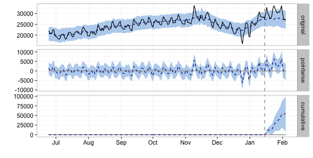

# Causal Impact function

## Introduction

#### How this function works.

This function helps answer the question "Did a given event have any impact on a target variable?". In this context, the target variable is likely to be conversion rate or number of conversions.

This code was created to simplify execution of the [R Causal Impact package](https://google.github.io/CausalImpact/CausalImpact.html) which is created and shared by Google. The Google package uses Bayesian structural time-series models to make a counterfactual prediction of a response variable and compare this to actual data, to determine the effect of a given event on this variable.

#### Package dependencies

The function uses the xlsx, lubridate and CausalImpact packages. If you do not have these installed, enter the following code in your R console:

```r
install.packages(c("lubridate","CausalImpact","xlsx"))
```

## Calling the function

Call the function by entering `causalFunction(data, event="2015-12-31")` in your console.

### Function arguments

_data_
  - "data" is the web analytic data on which the causal impact model will be built. Lines 9-11 in the causalImpact.R file provide code for reading in the analytics data from a csv file which must be copied into the "data" subfolder and named "gdata.csv". An example file can be found in the data folder.

"data" must be a data frame with the following column names:

1. "date" (character class), in the standard format outputted by Google Analytics (e.g. "20151230").
2. "conversions" (numeric class), the response variable for which you will observe the effect of a given event.
3. "users" (numeric class), a single explanatory variable. (Support for additional explanatory variables to be added in the future).

_event_
  - "event" is the date  must be supplied as a character string in the format "YYYY-mm-dd". This is the date of the intervention whose impact you wish to measure.

## Function output



The function uses the time-series data prior to the event to train its prediction, then determines the effect of the intervention by comparing the actual post-event values of the response variable with the predicted values.

3 outputs are produced by the function:

1. A plot showing 3 graphs (see example above):
	- "Original": showing a line graph of the response variable values in black, and the modelled values in a dotted line with CIs shaded in blue.
	- "Pointwise": showing the difference between observed data and counterfactual predictions.
	- "Cumulative": showing the cumulative effect of the intervention by adding up the pointwise contributions.
2. A summary data table which prints to the console and includes the following key values:
	- Average: actual / prediction. The average predicted and actual values for the response value after the intervention.
	- Absolute effect. The absolute difference between predicted and actual values of the response variable.
	- Relative effect. The proportional impact of the intervention. If the 95% CIs do not include 0% in the range, you can conclude that the intervention had a statistically significant intervention.
3. A more detailed summary report, also printed to the console, which describes the results of the modelling.